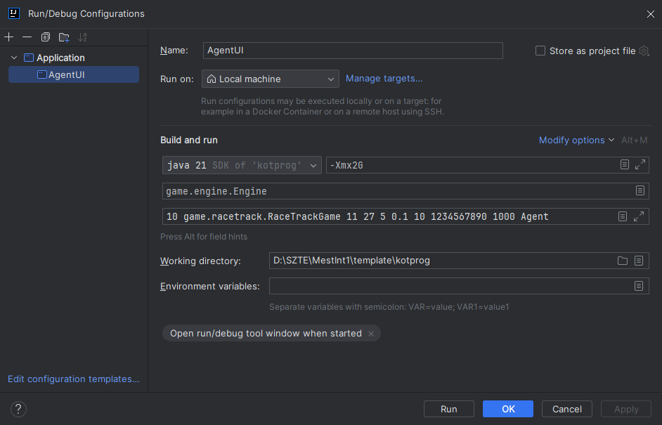

# Mesterséges Intelligencia 1 - Kötelező program segédlet

Össze szedtem néhány tippet a keretrendszer használatához, amikel nagyon felgyorsíthatod a kötelező prgram megírását.

## Setup

Ha nincs kedved ezzel vacakolni: [**Előre beállított IDEA projekt letöltése (V11.20)**](../../assets/other/egyeb/mestint1/racetrack-idea-project.zip)

1. Hozz létre egy új projektet és másold bele benne a `libs` mappába a `game_engine.jar` fájlt
2. IDEA-ban a `File/Project Structure.../Libraries/Add New Project Library/Java` menüpontban add hozzá a `game_engine.jar` file-t
3. A `src` mappában hozz létre egy `Agent.java` osztályt, aminek ez legyen a tartalma:

```java
///Nicknevem,Vezeteknev.Keresztnev@stud.u-szeged.hu
import java.util.Random;

import game.racetrack.Direction;
import game.racetrack.RaceTrackGame;
import game.racetrack.RaceTrackPlayer;
import game.racetrack.utils.Coin;
import game.racetrack.utils.PlayerState;

public class Agent extends RaceTrackPlayer {

    public Agent(PlayerState state, Random random, int[][] track, Coin[] coins, int color) {
        super(state, random, track, coins, color);
    }

    @Override
    public Direction getDirection(long remainingTime) {
        return RaceTrackGame.DIRECTIONS[random.nextInt(RaceTrackGame.DIRECTIONS.length)];
    }
}
```

## Futtatás

A tanár azt javasolta az alábbi parancsokkal indítsuk terminálból az alkalmazást, de én találtam egy kényelmesebb megoldást is.

```bash
# Fordítás:
 javac -cp game_engine.jar Agent.java
 
 # Futtatás grafikus felülettel: 
 java -Xmx2G -jar game_engine.jar 5 game.racetrack.RaceTrackGame 11 27 5 0.1 10 1234567890 1000 Agent
```

### Run Config beállítása InteliJ IDEA-ban

Be lehet állítani IDEA-ban, hogy egyetlen kattintással fordítsa és futtassa az alkalmazást. Ha nincs kedved ezzel vacakolni: [**Előre beállított IDEA projekt letöltése**](../../assets/other/egyeb/mestint1/racetrack-idea-project.zip)

Manuális módszer:

1. Jobb felül a `Run / Debug configuration` résznél hozz létre egy új Application konfigurációt
2. Paraméterezd fel így (A Modify options alatt be kell kapcsolni az Add VM options-t): 
3. A jobb felső sarokban a zöld háromszög ikonnal indul is az alkalmazás

## Debug

Ha eddig nem használtad volna az IDEA vagy bármelyik IDE debug módját, itt az ideje megismerkedned vele, mert ezzel a módszerrel gyorsan és egyszerűen rá lehet jönni mi a hiba egy programban. Plusz ahogy én látom ebben a keretrendszerben semmilyen más lehetőség nincs hiba keresésre.

[Egy kis segítség debug-hoz](https://youtu.be/IeUZZoZE3sU?si=AlbJ2HU1YkjbGsan)

Ha beállítottad IDEA-ban a Run Configot, csak dobj pár breakpoint-ot a kódba és a kis bogárka ikonnal debug módban fog indulni az app.

## Keretrendszer Felépítése

Azt gondolom már észre vetted, hogy minden forráskód, futtatható állomány és dokumentáció egy .jar fájlba lett tömörítve. Ezt ugyan úgy ki lehet tömöríteni, mint egy .zip-et. A `game/racetrack` package-ben vannak az osztályok amiket használhatunk. Most csak bemutatom milyen eszközök állnak
rendelkezésünkre, a működésükről a forráskódban vagy a `javadoc` mappában olvashatsz bővebben.

### `#!java RaceTrackPlayer` osztály reprezentálja a pályát és az autót

Ennek az osztálynak hozzuk létre egy leszármazottját, mikor létre hozzuk a `Agent`-t.

#### Hasznos osztály változói

- `PlayerState state`: position and velocity of the player
- `int[][] track`: represents the track of the game
- `Coin[] coins`: list of coins on the track

#### Hasznos metódusai:

```java
public Agent(PlayerState state,Random random,int[][]track,Coin[]coins,int color)
```

- Ez a konstruktora.
- Nem az ilyesztő paraméterei az érdekesek, hanem hogy csak egyszer fut le, így bele lehet írni az út kereső
  algoristmust.

```java
public abstract Direction getDirection(long remainingTime)
```

- Minden iterációban meghívódik és kiszámol egy irányt amerre tovább fog menni az autó.
- Ezt kell felül definiállnunk a saját Player-ünkben, hogy vezethessük.

### `#!java RaceTrackGame` osztály - a segéd funkciók tárháza

Van egy rakás hasznos statikus metódusa, amik sokat segíthetnek. Példányosítani sem kell az osztályt a használatukhoz:

```java
boolean tureIfTheCellIsAWall=RaceTrackGame.isNotWall(cell,track);
```

#### Hasznos metódusai:

```java
// Returns true iff the specified value contains the specified mask.
public static boolean mask(int value,int mask)

// Performs a breadth-first-search from the specified position on the specified track 
// while one of a FINISH cell has been reached.
public static List<PathCell> BFS(int i,int j,int[][]track)

// Returns true, iff the cell of the specified track is not a wall at the specified position.
public static boolean isNotWall(int i,int j,int[][]track)

// Returns true, iff the specified cell of the specified track is not a wall.
public static boolean isNotWall(Cell cell,int[][]track)

// Returns true, iff none of the cells of specified list are walls on the specified track.
public static boolean isNeitherWall(List<Cell> list,int[][]track)

// Returns the coordinates of the line between the specified points. 
// The line drawing algorithm is based on the Bresenham's line algorithm
public static List<Cell> line8connect(Cell from,Cell to)

// Returns the coordinates of the line between the specified points, but the line 
// is 4-connected instead of 8. The line drawing algorithm is based on the Bresenham's line algorithm
public static List<Cell> line4connect(Cell from,Cell to)

//Returns a negative integer, zero, or a positive integer as specified cell (i,j) 
// is on the right site, on, or on the left side of the line specified by A-B po[ints (ai,aj)-(bi,bj)
public static int side(int ai,int aj,int bi,int bj,int i,int j)

// Returns the list of cells which are crossed or touched (its corner is on the line) 
// by the line defined by the specified coordinates.
public static List<Cell> lineCrossing(Cell from,Cell to)

// Returns the manhattan distance between the specified positions.
public static int manhattanDistance(Cell a,Cell b)

// Returns the euclidean distance between the specified positions.
public static double euclideanDistance(Cell a,Cell b)

// Returns a direction object from the specified cell to the other specified one.
public static Direction direction(Cell from,Cell to)

// Converts the position of the specified state to a Cell object.
public static Cell toCell(PlayerState state)

// Converts the position of the specified players to a Cell object.
public static Cell toCell(RaceTrackPlayer player)
```

### `game/utils` - modell osztályok

Ebben package-ben modell osztályokat találhatsz, amikkel a fentebbi metódusokat használhatod.