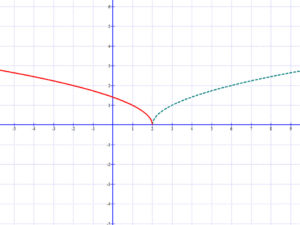
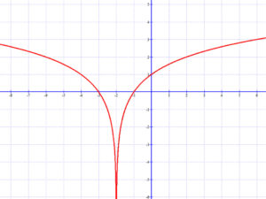

# Függvény transzformációk

[Forrás](https://matekarcok.hu/fuggvenytranszformaciok/)

Magán a függvényen (pl.: $f(x)+2$ ; $\frac{1}{x}+2$) vagy a függvény változóján (pl.: $f(x+c)$ ; $\frac{1}{x+c}$) tudunk végre hajtani műveleteket. Nagyon fontos hogy melyiken, mert ugyan az a művelet máshogy viselkedik a két esetben.

!!! note
    Ha magán a függvényen hajtunk végre műveleteket, akkor a függőleges y tengelyét módosítjuk, ha a függvény változóján, akkor a vízszintes x tengelyét.

## Magán a függvényen végre hajtható műveletek

### Függvény szorzása egy pozitív számmal

A függvény meredekségének változása.

### Függvény szorzása -1-gyel.

A függvény tükrözése az „x” tengelyre.

### Egy állandó hozzáadása a függvény értékéhez.

A függvény eltolása az „y” tengely mentén.

### Függvény abszolút értéke.

A függvény negatív részének tükrözése az „x” tengelyre. (felvisszük a negatív részt)

## A függvény változóján végre hajtható műveletek

### Egy állandó hozzáadása függvény változójához.

A függvény eltolása az „x” tengely mentén. Ha c>0, akkor negatív irányban,ha c<0, akkor pozitív irányban.

### Függvény változójának szorzása -1-gyel.

Tükrözés az x tengely mentén.

$$
\sqrt{-1 \cdot (x-2)}
$$

### Függvény változójának szorzása egy pozitív állandóval.

„Nyújtás” az x tengely mentén.

### Függvény változójának abszolút értéke.

A függvény tükrözése az y tengellyel párhuzamos tengelyre.

$$
\log_2 |x+2|\
$$