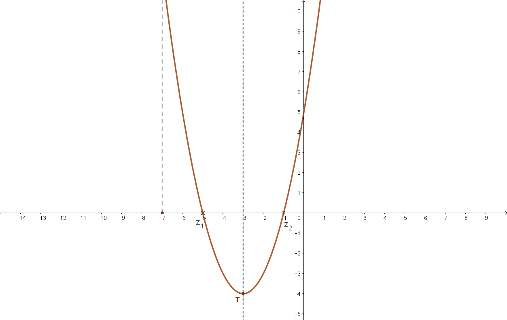
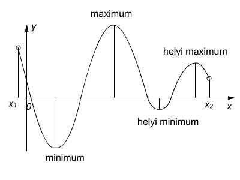

# Függvények

A függvények lényegében a matematikusok gépei. Olyanok mint egy varázsdoboz: bele dobsz egy számot (input), végrehajt rajta egy rakás módosítást és kiesik a végén egy eredmény (output).

$$
f(x) = \frac{x-1}{2}
$$

Ez a bonyolult felírás lényegében annyit mond, hogy melyik változón és milyen módosítást kell végre hajtani a gépnek.

> Nevezzük el a gépünket (függvényünket) f-nek, várjon egy x nevű bemeneti változót. Vonjon ki belőle 1-et majd ossza el 2-vel és adja vissza az eredményt

Így talán ismerősebb lesz:

```c
float f(float x) {
    return (x-1)/2;
}
```

A 5 helyen a függvény a 2 értéket veszi fel. Szóval a függvény értéke az 5 helyen 2 lesz.

## Értelmezési tartomány és érték készlet

## Függvény grafikonja (képe)

A függvény bemeneti változóját sokszor x-nek, a kimeneti változót sokszor y-nak szoktuk nevezni egy praktikus okból: így egyszerűbb ábrázolni grafikonon. Ha az x koordináta lesz a bemeneti változó, y a kimeneti, kirajzolódik a függvény képe:



!!! note
    Ha vesszük a függvény egy pontját, annak első az az x koordinátáját **helynek**, másodikat az az y-t **értéknek** vagy függvényértéknek szoktuk nevezni.

Az x tengely a bemeneti változó lehetséges értékeit, az y tengely a függvény által erre adott eredményt mutatja. Ebből általában kirajzolódik egy szép vonal, aminek minden pontja megadja hogy adott inputra milyen output-ot ad a függvény. Más szavakkal hogy az adott helyen milyen értéket vesz fel a függvény.

$[6, 2]$

$[x = hely = 6, y = érték = 2]$

A 6 helyen 2 értéket vesz fel a függvény. A 6 helyen a függvényérték 2 lesz.

### Szélső érték


### Zérushely

Azokat a helyeket nevezzük zérus helynek, ahol a függvény értéke nulla. Magyarul ha y=0, akkor zérus helyen vagyunk. Ha nem metszi az x tengelyt a függvény, nincs zérushelye.

Ezt így lehet kiszámolni $f(x) = 0$ -> Keresnünk kell egy olyan x-et, amivel ha kiszámoljuk a függvény értékét, nullát kapunk.

> Gimiben a másodfokú egyenletek megoldásánál, lényegében a függvény zérus helyeit kerestük: $x^2+2x-1 = 0$

### Minimum, maximum, lokális minimum, lokális maximum

Minimum és maximum néven lényegében a függvény **legkisebb és legnagyobb pontját** vagy pontjait keressük. A feladatoknál meg kell mutatni hogy nem vehet fel ennél kisebb értéket a függvény, nincs ennél lentebbi pont a grafikonon.



Ha sétálsz lefelé egy hegyről és egyszer csak azt veszed észre hogy már felfelé mész egy másik hegyrem akkor áthaladtál egy völgyön, egy lokális (helyi) minimum ponton. Tudod hogy a hely ahol jártál lentebb van mint az előtte és utána lévő részek, de azt nem vajon ez e a legalacsonyabb pont a környéken.


- Ha csökken a függvény értéke, majd elkezdett nőni, lokális minimum volt, ha nőtt majd elkezdett csökkeni lokális maximum volt.
- A sima minimum/maximum a legkisebb/legnagyobb lokális minimum/maximum
- Ha elszáll a végtelenbe vagy a minusz végtelenbe a függvény nincs minimuma/maximuma, de lokális minimuma vagy maximuma lehet.

### Monotonitás

Azt mondja meg hogy az adott helyen nő vagy csökken a függvény.

- **Monoton csökken/növekszik**: kisebb/nagyobb helyhez kisebb/nagyobb vagy egyenlő érték tartozik
  - előző pont <= jelenlegi pont -> Monton növekszik
- **Szigoróan monoton csökken/növekszik**: A függvény minden pontja biztosan kisebb/nagyobb az előzőnél az adott intervallumban
  - a kisebb/nagyobb bemenethez mindig kisebb/nagyobb kimenet tartozik.
  - előző pont < jelenlegi pont -> szigorúan monton növekszik
  - Általában ilyenekkel dolgozunk.
  - pl. z $x$ függvény.

### Konvexitás

### Inflexiós pont

### Paritás